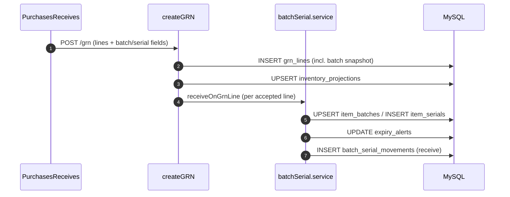
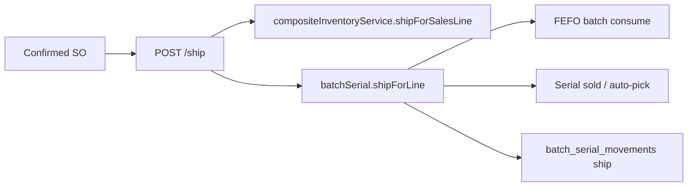

# Batch / serial lifecycle

## Purpose

Track **batch (lot) numbers**, **serial numbers**, and **expiry dates** from inbound receipt through outbound shipment and returns. Inventory projections (`quantity_on_hand`) stay the source of truth for totals; batch/serial tables record **which** lots and units moved at each step.

## Item setup (prerequisite)

On the item master (`items` table):

| Flag | Column | Effect |
|------|--------|--------|
| Batch tracked | `is_batch_tracked` | GRN requires batch #; ship/returns consume or restore batch qty |
| Serialized | `is_serialized` | GRN requires one serial per unit; ship marks serials `sold`; returns restore `available` |
| Expiry | `has_expiry` | GRN requires expiry date when batch tracked; drives expiry alerts |

Non-tracked items skip batch/serial UI and lifecycle hooks.

## Database

| Table / column | Role |
|----------------|------|
| `item_batches` | Batch/lot per item + warehouse (qty received/remaining, mfg/expiry, status) |
| `item_serials` | Serial per item (+ optional `batch_id`, status lifecycle) |
| `expiry_alerts` | Alerts when batch expiry is within 90 days and qty > 0 |
| `batch_serial_movements` | Audit trail: receive, ship, purchase_return, sales_return |
| `grn_lines.batch_number`, `manufacture_date`, `expiry_date`, `serial_numbers` | Snapshot on receipt |
| `purchase_return_lines.batch_allocations`, `serial_ids` | Selected lots/serials on vendor return |

Migration: `Backend/src/database/migrations/20260620_001_batch_serial_lifecycle.sql`  
(Use plain SQL in phpMyAdmin on shared hosting — no `information_schema`.)

## API base path

`/api/batch-serial`

### Standalone CRUD (Batch Tracking page)

| Method | Path | Permission | Description |
|--------|------|------------|-------------|
| POST | `/batches` | `inventory_receive` | Manual batch create |
| GET | `/batches` | `inventory_view` | List/filter batches |
| POST | `/batches/:batchId/consume` | `inventory_adjust` | Manual consume |
| PUT | `/batches/:batchId/status` | `inventory_adjust` | active / expired / damaged / recalled |
| PUT | `/batches/:batchId/dates` | `inventory_adjust` | Set mfg/expiry (once) |
| POST | `/serials` | `inventory_receive` | Register serials |
| GET | `/serials` | `inventory_view` | List/filter serials |
| PUT | `/serials/:serialId/status` | `inventory_adjust` | available / reserved / sold / damaged / returned |
| GET | `/expiry-alerts` | `inventory_view` | Active expiry alerts |
| PUT | `/expiry-alerts/:alertId/acknowledge` | `inventory_view` | Acknowledge alert |
| POST | `/expiry-alerts/refresh` | `inventory_management` | Recompute alerts + mark expired batches |
| GET | `/movements` | `inventory_view` | Lifecycle audit log |

## End-to-end workflows

### 1. Purchase receive (GRN)

**Page:** `Frontend/src/pages/purchases/PurchasesReceives.jsx`  
**API:** `POST /api/grn` → `purchaseOrder.service.js#createGRN`



**Per line (accepted only):**

- **Batch tracked:** `batchNumber` required; `expiryDate` required if `has_expiry`.
- **Serialized:** `serialNumbers` — count must equal `quantityReceived` (integer units).
- **Rejected lines:** inventory and batch/serial are **not** updated.

**Request line fields (optional unless item flags require them):**

```json
{
  "batchNumber": "LOT-2026-A",
  "manufactureDate": "2026-01-15",
  "expiryDate": "2027-01-15",
  "serialNumbers": ["SN-001", "SN-002"]
}
```

### 2. Shipment (packages / outbound)

**Pages:** `Shipments.jsx` **or** confirm SO from `SalesOrders.jsx`  
**API:** `POST /api/sales-orders/:soId/ship` **or** `PUT /api/sales-orders/:id/status` with `confirmed`  
→ `salesOrder.service.js#shipSalesOrder` **or** `soConfirmation.service.js#processSOConfirmation`

Both ship paths call `batchSerial.shipForLine` (FEFO when no batch is selected).



**Batch tracked:**

- Optional `batchAllocations: [{ batchId, quantity }]`.
- If omitted → **FEFO** (earliest `expiry_date` first, then oldest batch).

**Serialized:**

- Optional `serialIds: [uuid, ...]`.
- If omitted → oldest `available` serials auto-selected.
- Count must match ship quantity (integer).

### 3. Purchase return (to vendor)

**Page:** `Frontend/src/pages/purchases/PurchaseReturns.jsx`  
**API:** `POST /api/purchase-returns` (draft) → `POST /api/purchase-returns/:id/confirm`

On **confirm**, after inventory deduction:

- **Batch:** consume via FEFO or stored `batch_allocations`.
- **Serial:** remove selected (or auto-picked) serial rows from `item_serials`.
- Log `purchase_return` movements.

### 4. Sales return (from customer)

**Page:** `Frontend/src/pages/sales/SalesReturns.jsx`  
**API:** `POST /api/sales-orders` with `status: "returned"`

- Does **not** reserve stock; calls `inventoryService.returnSale` (+ projection).
- **Batch:** restores qty into batch (`batchNumber` or auto `RTN-<timestamp>`).
- **Serial:** reactivates existing serials or creates new `available` rows.
- Log `sales_return` movements.

### 5. Expiry alerts

- Created/updated when batches are received or consumed (`_checkAndCreateExpiryAlert`).
- Window: batches expiring within **90 days** with `quantity_remaining > 0`.
- **Refresh job:** `POST /batch-serial/expiry-alerts/refresh` marks past-date batches/alerts as `expired`.
- **UI:** Batch Tracking → **Expiry Alerts** tab; badge on active count.

### 6. Lifecycle audit

**UI:** Batch Tracking → **Lifecycle** tab  
**API:** `GET /batch-serial/movements`

Movement types: `receive` | `ship` | `purchase_return` | `sales_return`

## Backend files

| File | Role |
|------|------|
| `Backend/src/modules/inventory/batchSerial.service.js` | CRUD + lifecycle hooks |
| `Backend/src/modules/inventory/batchSerial.controller.js` | HTTP handlers |
| `Backend/src/modules/inventory/batchSerial.routes.js` | Routes + permissions |
| `Backend/src/modules/order/purchaseOrder.service.js` | GRN → `receiveOnGrnLine` |
| `Backend/src/modules/order/salesOrder.service.js` | Ship → `shipForLine`; returns → `restoreForSalesReturn` |
| `Backend/src/modules/order/soConfirmation.service.js` | SO confirm → `shipForLine` (FEFO) |
| `Backend/src/modules/order/purchaseReturn.service.js` | Confirm → `deductForPurchaseReturn` |

## Frontend files

| File | Role |
|------|------|
| `Frontend/src/pages/inventory/BatchTracking.jsx` | Batches, serials, expiry alerts, lifecycle |
| `Frontend/src/components/inventory/BatchSerialLineFields.jsx` | GRN + shipment form fields |
| `Frontend/src/components/inventory/BatchSerialLinePanel.jsx` | Purchase/sales return line fields |
| `Frontend/src/pages/purchases/PurchasesReceives.jsx` | Receive with batch/serial |
| `Frontend/src/pages/inventory/Shipments.jsx` | Ship with batch/serial |
| `Frontend/src/pages/purchases/PurchaseReturns.jsx` | Vendor return out |
| `Frontend/src/pages/sales/SalesReturns.jsx` | Customer return in |

## Permissions

| Action | Permission |
|--------|------------|
| Receive batches / serials (GRN, manual create) | `inventory_receive` |
| View batches, serials, alerts, movements | `inventory_view` |
| Manual consume / status / dates | `inventory_adjust` |
| Refresh expiry alerts | `inventory_management` |

## Validation rules (summary)

| Step | Batch tracked | Serialized |
|------|---------------|------------|
| GRN | Batch # required; expiry if `has_expiry` | Serial count = receive qty |
| Ship | Allocation total = ship qty (or FEFO) | Serial count = ship qty (or auto) |
| Purchase return | FEFO or explicit batch | Serials removed from stock |
| Sales return | Batch restored (named or RTN-*) | Serials → `available` |

## Related features

- [Procurement GRN](../../docs/WORKFLOW.md#74-grn--what-actually-happens) — §7.4 in `docs/WORKFLOW.md`
- [Sales shipment](../../docs/WORKFLOW.md#83-sales-order-lifecycle) — §8.3
- Item import batch columns — `Items.jsx` / opening stock batches

## Not in scope (yet)

- **Packages** page (`Packages.jsx`) — placeholder; use **Shipments** for outbound batch/serial.
- Bin-level batch assignment at GRN (default bin on item is not consumed by GRN today).
- Variant-level batch tracking (batches keyed by `item_id` only).
