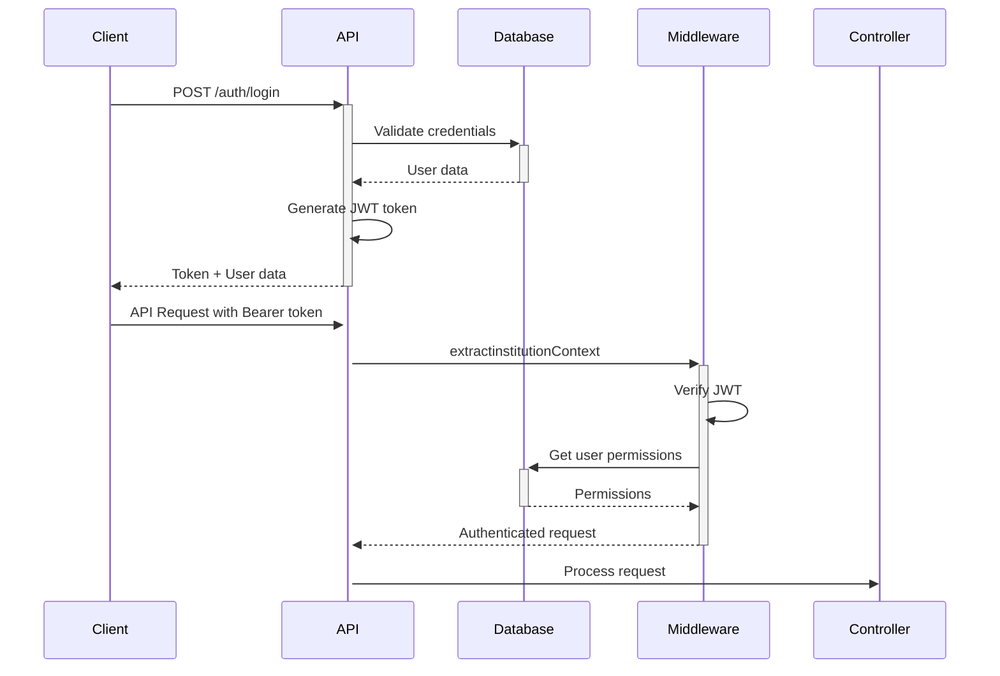

# IMS SEPCUNE - Complete Developer Guide

## Table of Contents
1. [System Architecture](#system-architecture)
2. [API Flow & Control](#api-flow--control)
3. [Authentication & Authorization](#authentication--authorization)
4. [Database Schema](#database-schema)
5. [Backend Flow](#backend-flow)
6. [Frontend Flow](#frontend-flow)
7. [Debugging Guide](#debugging-guide)
8. [Error Handling](#error-handling)
9. [Testing](#testing)
10. [Deployment](#deployment)

## System Architecture

### Tech Stack
- **Backend**: Node.js, Express.js
- **Database**: MySQL
- **Frontend**: React.js, Ant Design
- **Authentication**: JWT
- **Architecture**: Multi-institution SaaS

### Directory Structure
```
Backend/
├── src/
│   ├── config/          # Configuration files
│   ├── controllers/     # Route handlers
│   ├── middleware/      # Authentication, validation
│   ├── routes/          # API routes
│   ├── services/        # Business logic
│   ├── database/        # Database connection & migrations
│   ├── utils/           # Helper functions
│   └── app.js          # Express app setup
├── debug-session.js     # Debug script
└── package.json

Frontend/
├── src/
│   ├── components/      # Reusable components
│   ├── pages/          # Page components
│   ├── services/       # API services
│   ├── hooks/          # Custom hooks
│   ├── contexts/       # React contexts
│   └── utils/          # Helper functions
└── package.json
```

## API Flow & Control

### 1. Request Lifecycle

```
Client Request → Middleware Chain → Controller → Service → Database → Response
```

#### Middleware Chain Order:
1. **CORS** - Cross-origin resource sharing
2. **Body Parser** - Parse request body
3. **extractinstitutionContext** - Extract institution from token/subdomain
4. **requireAuth** - Validate JWT token
5. **requirePermission** - Check user permissions
6. **validateinstitutionConsistency** - Ensure institution data consistency
7. **Controller** - Handle business logic

### 2. Authentication Flow



### 3. Inventory API Flow Example

#### GET /api/inventory
```javascript
// 1. Request hits middleware chain
app.get('/inventory', 
  extractinstitutionContext,     // Extract institution
  requireAuth,              // Validate token
  requirePermission('inventory_view'), // Check permissions
  inventoryController.getInventory     // Handle request
);

// 2. Controller processes request
async getInventory(req, res) {
  try {
    const { institutionId } = req;
    const inventory = await inventoryService.getByinstitution(institutionId);
    res.json({ success: true, data: inventory });
  } catch (error) {
    res.status(500).json({ success: false, error: error.message });
  }
}

// 3. Service handles business logic
async getByinstitution(institutionId, filters = {}) {
  const query = `
    SELECT i.*, it.name as item_name, w.name as warehouse_name
    FROM inventory i
    JOIN items it ON i.item_id = it.id
    JOIN warehouses w ON i.warehouse_id = w.id
    WHERE i.institution_id = ?
  `;
  return await db.query(query, [institutionId]);
}
```

## Authentication & Authorization

### JWT Token Structure
```javascript
{
  "userId": "uuid",
  "institutionId": "uuid", 
  "email": "user@example.com",
  "role": "admin|user",
  "permissions": {
    "inventory_view": true,
    "inventory_create": true,
    // ... other permissions
  },
  "iat": 1234567890,
  "exp": 1234567890
}
```

### Permission System
```javascript
// Permission middleware
const requirePermission = (permission) => {
  return (req, res, next) => {
    const userPermissions = req.user.permissions || {};
    
    // Admin has all permissions
    if (req.user.role === 'admin' || userPermissions.all === true) {
      return next();
    }
    
    // Check specific permission
    if (userPermissions[permission] === true) {
      return next();
    }
    
    res.status(403).json({ 
      error: 'Insufficient permissions',
      required: permission
    });
  };
};
```

### Session Management
```javascript
// Session expiration handling
const SESSION_TIMEOUT = 15 * 60 * 1000; // 15 minutes

// Frontend session check
useEffect(() => {
  const lastActivity = sessionStorage.getItem('lastActivity');
  if (lastActivity) {
    const timeSinceLastActivity = Date.now() - parseInt(lastActivity);
    if (timeSinceLastActivity > SESSION_TIMEOUT) {
      // Show session expired modal
      logout();
    }
  }
}, []);
```

## Database Schema

### Core Tables
```sql
-- institutions (Multi-tenancy)
CREATE TABLE institutions (
  id VARCHAR(36) PRIMARY KEY,
  name VARCHAR(255) NOT NULL,
  subdomain VARCHAR(100) UNIQUE,
  status ENUM('active', 'inactive') DEFAULT 'active',
  created_at TIMESTAMP DEFAULT CURRENT_TIMESTAMP
);

-- Users
CREATE TABLE users (
  id VARCHAR(36) PRIMARY KEY,
  institution_id VARCHAR(36) NOT NULL,
  email VARCHAR(255) UNIQUE NOT NULL,
  password_hash VARCHAR(255) NOT NULL,
  role ENUM('admin', 'user') DEFAULT 'user',
  permissions JSON,
  status ENUM('active', 'inactive') DEFAULT 'active',
  FOREIGN KEY (institution_id) REFERENCES institutions(id)
);

-- Items
CREATE TABLE items (
  id VARCHAR(36) PRIMARY KEY,
  institution_id VARCHAR(36) NOT NULL,
  name VARCHAR(255) NOT NULL,
  sku VARCHAR(100) NOT NULL,
  description TEXT,
  unit_price DECIMAL(10,2),
  UNIQUE KEY unique_institution_sku (institution_id, sku),
  FOREIGN KEY (institution_id) REFERENCES institutions(id)
);

-- Warehouses
CREATE TABLE warehouses (
  id VARCHAR(36) PRIMARY KEY,
  institution_id VARCHAR(36) NOT NULL,
  name VARCHAR(255) NOT NULL,
  location VARCHAR(255),
  type ENUM('main', 'branch', 'virtual') DEFAULT 'main',
  FOREIGN KEY (institution_id) REFERENCES institutions(id)
);

-- Inventory
CREATE TABLE inventory (
  id VARCHAR(36) PRIMARY KEY,
  institution_id VARCHAR(36) NOT NULL,
  item_id VARCHAR(36) NOT NULL,
  warehouse_id VARCHAR(36) NOT NULL,
  quantity_on_hand INT DEFAULT 0,
  quantity_available INT DEFAULT 0,
  quantity_reserved INT DEFAULT 0,
  UNIQUE KEY unique_item_warehouse (institution_id, item_id, warehouse_id),
  FOREIGN KEY (institution_id) REFERENCES institutions(id),
  FOREIGN KEY (item_id) REFERENCES items(id),
  FOREIGN KEY (warehouse_id) REFERENCES warehouses(id)
);
```

## Backend Flow

### 1. Server Startup
```javascript
// server.js
const express = require('express');
const app = require('./src/app');

const PORT = process.env.PORT || 5000;

app.listen(PORT, () => {
  console.log(`Server running on port ${PORT}`);
});

// app.js
const express = require('express');
const cors = require('cors');
const helmet = require('helmet');

const app = express();

// Middleware
app.use(helmet());
app.use(cors());
app.use(express.json());

// Routes
app.use('/api/auth', require('./routes/auth'));
app.use('/api/inventory', require('./routes/inventory'));
app.use('/api/items', require('./routes/items'));

module.exports = app;
```

### 2. Route Definition
```javascript
// routes/inventory.js
const express = require('express');
const router = express.Router();
const inventoryController = require('../controllers/inventoryController');
const { extractinstitutionContext, requireAuth, requirePermission } = require('../middleware/auth');

// Apply middleware to all routes
router.use(extractinstitutionContext);
router.use(requireAuth);

// Routes
router.get('/', requirePermission('inventory_view'), inventoryController.getInventory);
router.post('/receive', requirePermission('inventory_receive'), inventoryController.receiveStock);
router.post('/adjust', requirePermission('inventory_adjust'), inventoryController.adjustStock);

module.exports = router;
```

### 3. Controller Layer
```javascript
// controllers/inventoryController.js
const inventoryService = require('../services/inventoryService');
const logger = require('../utils/logger');

class InventoryController {
  async getInventory(req, res) {
    try {
      const { institutionId } = req;
      const { warehouseId, itemId } = req.query;
      
      const inventory = await inventoryService.getInventory({
        institutionId,
        warehouseId,
        itemId
      });
      
      logger.info('Inventory retrieved', { institutionId, count: inventory.length });
      
      res.json({
        success: true,
        data: inventory
      });
    } catch (error) {
      logger.error('Error getting inventory', { error: error.message, institutionId: req.institutionId });
      res.status(500).json({
        success: false,
        error: 'Failed to retrieve inventory'
      });
    }
  }

  async receiveStock(req, res) {
    try {
      const { institutionId, user } = req;
      const stockData = { ...req.body, institutionId, userId: user.userId };
      
      const result = await inventoryService.receiveStock(stockData);
      
      logger.info('Stock received', { institutionId, itemId: stockData.itemId, quantity: stockData.quantity });
      
      res.json({
        success: true,
        data: result
      });
    } catch (error) {
      logger.error('Error receiving stock', { error: error.message, institutionId: req.institutionId });
      res.status(500).json({
        success: false,
        error: 'Failed to receive stock'
      });
    }
  }
}

module.exports = new InventoryController();
```

### 4. Service Layer
```javascript
// services/inventoryService.js
const db = require('../database/connection');
const { v4: uuidv4 } = require('uuid');

class InventoryService {
  async getInventory({ institutionId, warehouseId, itemId }) {
    let query = `
      SELECT 
        i.*,
        it.name as item_name,
        it.sku,
        w.name as warehouse_name
      FROM inventory i
      JOIN items it ON i.item_id = it.id
      JOIN warehouses w ON i.warehouse_id = w.id
      WHERE i.institution_id = ?
    `;
    
    const params = [institutionId];
    
    if (warehouseId) {
      query += ' AND i.warehouse_id = ?';
      params.push(warehouseId);
    }
    
    if (itemId) {
      query += ' AND i.item_id = ?';
      params.push(itemId);
    }
    
    query += ' ORDER BY it.name, w.name';
    
    return await db.query(query, params);
  }

  async receiveStock({ institutionId, itemId, warehouseId, quantity, unitCost, poId, grnNumber }) {
    const connection = await db.getConnection();
    
    try {
      await connection.beginTransaction();
      
      // 1. Update or create inventory record
      const inventoryId = await this.updateInventory(connection, {
        institutionId,
        itemId,
        warehouseId,
        quantityChange: quantity,
        type: 'receive'
      });
      
      // 2. Create inventory transaction
      await this.createTransaction(connection, {
        id: uuidv4(),
        institutionId,
        inventoryId,
        type: 'receive',
        quantity,
        unitCost,
        poId,
        grnNumber,
        createdAt: new Date()
      });
      
      await connection.commit();
      
      return { inventoryId, message: 'Stock received successfully' };
    } catch (error) {
      await connection.rollback();
      throw error;
    } finally {
      connection.release();
    }
  }

  async updateInventory(connection, { institutionId, itemId, warehouseId, quantityChange, type }) {
    // Check if inventory record exists
    const [existing] = await connection.query(
      'SELECT id, quantity_on_hand, quantity_available FROM inventory WHERE institution_id = ? AND item_id = ? AND warehouse_id = ?',
      [institutionId, itemId, warehouseId]
    );
    
    if (existing.length > 0) {
      // Update existing record
      const newOnHand = existing[0].quantity_on_hand + quantityChange;
      const newAvailable = existing[0].quantity_available + quantityChange;
      
      await connection.query(
        'UPDATE inventory SET quantity_on_hand = ?, quantity_available = ?, updated_at = NOW() WHERE id = ?',
        [newOnHand, newAvailable, existing[0].id]
      );
      
      return existing[0].id;
    } else {
      // Create new record
      const inventoryId = uuidv4();
      
      await connection.query(
        'INSERT INTO inventory (id, institution_id, item_id, warehouse_id, quantity_on_hand, quantity_available) VALUES (?, ?, ?, ?, ?, ?)',
        [inventoryId, institutionId, itemId, warehouseId, quantityChange, quantityChange]
      );
      
      return inventoryId;
    }
  }
}

module.exports = new InventoryService();
```

## Frontend Flow

### 1. API Service Layer
```javascript
// services/apiService.js
class ApiService {
  constructor() {
    this.api = axios.create({
      baseURL: process.env.REACT_APP_API_URL || 'http://localhost:5000/api',
      timeout: 30000
    });

    // Request interceptor - Add auth token
    this.api.interceptors.request.use((config) => {
      const token = sessionStorage.getItem('token');
      if (token) {
        config.headers.Authorization = `Bearer ${token}`;
      }
      return config;
    });

    // Response interceptor - Handle errors
    this.api.interceptors.response.use(
      (response) => {
        sessionStorage.setItem('lastActivity', Date.now().toString());
        return response.data;
      },
      async (error) => {
        if (error.response?.status === 401) {
          // Handle session expiration
          this.handleSessionExpired();
        }
        return Promise.reject(error);
      }
    );
  }

  async getInventory(params = {}) {
    return this.get('/inventory', { params });
  }

  async receiveStock(data) {
    return this.post('/inventory/receive', data);
  }
}

export default new ApiService();
```

### 2. React Component Flow
```javascript
// pages/Inventory.jsx
const Inventory = () => {
  const [inventory, setInventory] = useState([]);
  const [loading, setLoading] = useState(false);
  
  // Fetch data on component mount
  useEffect(() => {
    fetchInventory();
  }, []);

  const fetchInventory = async () => {
    try {
      setLoading(true);
      const response = await apiService.getInventory();
      if (response.success) {
        setInventory(response.data);
      }
    } catch (error) {
      message.error('Failed to fetch inventory');
    } finally {
      setLoading(false);
    }
  };

  const handleReceiveStock = async (values) => {
    try {
      const response = await apiService.receiveStock(values);
      if (response.success) {
        message.success('Stock received successfully');
        fetchInventory(); // Refresh data
      }
    } catch (error) {
      message.error('Failed to receive stock');
    }
  };

  return (
    <div>
      <Table 
        dataSource={inventory}
        loading={loading}
        columns={columns}
      />
    </div>
  );
};
```

## Debugging Guide

### 1. Backend Debugging

#### Enable Debug Mode
```bash
# Set environment variable
DEBUG=app:* npm run dev

# Or in .env file
DEBUG=app:*
NODE_ENV=development
```

#### Debug Script Usage
```bash
# Run debug script
npm run debug

# Expected output:
=== Session Debug Script ===
Testing API at: http://localhost:5000/api

1. Testing without token...
   Status: 401
   Error: Authentication required

2. Testing with invalid token...
   Status: 401
   Error: Invalid token

3. Testing with expired token...
   Status: 401
   Error: Session expired
   Code: SESSION_EXPIRED
```

#### Logging
```javascript
// utils/logger.js
const winston = require('winston');

const logger = winston.createLogger({
  level: 'info',
  format: winston.format.combine(
    winston.format.timestamp(),
    winston.format.errors({ stack: true }),
    winston.format.json()
  ),
  transports: [
    new winston.transports.File({ filename: 'logs/error.log', level: 'error' }),
    new winston.transports.File({ filename: 'logs/combined.log' }),
    new winston.transports.Console({
      format: winston.format.simple()
    })
  ]
});

module.exports = logger;
```

### 2. Frontend Debugging

#### Browser Console Debug Functions
```javascript
// Add to browser console
window.debugSession = {
  checkSession() {
    const token = sessionStorage.getItem('token');
    const lastActivity = sessionStorage.getItem('lastActivity');
    console.log('Token exists:', !!token);
    console.log('Last activity:', new Date(parseInt(lastActivity)));
  },
  
  testAPI() {
    fetch('/api/inventory', {
      headers: {
        'Authorization': `Bearer ${sessionStorage.getItem('token')}`
      }
    }).then(r => r.json()).then(console.log);
  }
};
```

#### React DevTools
```javascript
// Add to component for debugging
useEffect(() => {
  console.log('Component state:', { inventory, loading, user });
}, [inventory, loading, user]);
```

### 3. Database Debugging

#### Query Logging
```javascript
// Enable MySQL query logging
const mysql = require('mysql2');

const connection = mysql.createConnection({
  host: 'localhost',
  user: 'root',
  password: 'password',
  database: 'ims_db',
  debug: process.env.NODE_ENV === 'development'
});
```

#### Database Health Check
```javascript
// check-database.js
const db = require('./src/database/connection');

async function checkDatabase() {
  try {
    const [tables] = await db.query('SHOW TABLES');
    console.log('Database tables:', tables.map(t => Object.values(t)[0]));
    
    const [users] = await db.query('SELECT COUNT(*) as count FROM users');
    console.log('Total users:', users[0].count);
    
    const [inventory] = await db.query('SELECT COUNT(*) as count FROM inventory');
    console.log('Total inventory records:', inventory[0].count);
  } catch (error) {
    console.error('Database check failed:', error);
  }
}

checkDatabase();
```

## Error Handling

### 1. Backend Error Handling
```javascript
// Global error handler
app.use((error, req, res, next) => {
  logger.error('Unhandled error', {
    error: error.message,
    stack: error.stack,
    url: req.url,
    method: req.method,
    institutionId: req.institutionId
  });

  if (error.name === 'ValidationError') {
    return res.status(400).json({
      success: false,
      error: 'Validation failed',
      details: error.details
    });
  }

  if (error.code === 'ER_DUP_ENTRY') {
    return res.status(409).json({
      success: false,
      error: 'Duplicate entry'
    });
  }

  res.status(500).json({
    success: false,
    error: 'Internal server error'
  });
});
```

### 2. Frontend Error Handling
```javascript
// Error boundary component
class ErrorBoundary extends React.Component {
  constructor(props) {
    super(props);
    this.state = { hasError: false };
  }

  static getDerivedStateFromError(error) {
    return { hasError: true };
  }

  componentDidCatch(error, errorInfo) {
    console.error('Error caught by boundary:', error, errorInfo);
  }

  render() {
    if (this.state.hasError) {
      return <div>Something went wrong.</div>;
    }
    return this.props.children;
  }
}
```

## Testing

### 1. Backend Testing
```javascript
// tests/api.test.js
const request = require('supertest');
const app = require('../src/app');

describe('Inventory API', () => {
  let authToken;

  beforeAll(async () => {
    // Login and get token
    const response = await request(app)
      .post('/api/auth/login')
      .send({
        email: 'test@example.com',
        password: 'password'
      });
    
    authToken = response.body.data.token;
  });

  test('GET /api/inventory should return inventory list', async () => {
    const response = await request(app)
      .get('/api/inventory')
      .set('Authorization', `Bearer ${authToken}`)
      .expect(200);

    expect(response.body.success).toBe(true);
    expect(Array.isArray(response.body.data)).toBe(true);
  });

  test('POST /api/inventory/receive should receive stock', async () => {
    const stockData = {
      itemId: 'test-item-id',
      warehouseId: 'test-warehouse-id',
      quantity: 10,
      unitCost: 5.99
    };

    const response = await request(app)
      .post('/api/inventory/receive')
      .set('Authorization', `Bearer ${authToken}`)
      .send(stockData)
      .expect(200);

    expect(response.body.success).toBe(true);
  });
});
```

### 2. Frontend Testing
```javascript
// tests/Inventory.test.js
import { render, screen, waitFor } from '@testing-library/react';
import userEvent from '@testing-library/user-event';
import Inventory from '../pages/Inventory';

jest.mock('../services/apiService');

test('renders inventory table', async () => {
  const mockInventory = [
    { id: '1', item_name: 'Test Item', quantity_on_hand: 10 }
  ];

  apiService.getInventory.mockResolvedValue({
    success: true,
    data: mockInventory
  });

  render(<Inventory />);

  await waitFor(() => {
    expect(screen.getByText('Test Item')).toBeInTheDocument();
  });
});
```

## Deployment

### 1. Environment Configuration
```bash
# .env.production
NODE_ENV=production
PORT=5000
DB_HOST=production-db-host
DB_USER=production-user
DB_PASSWORD=production-password
DB_NAME=ims_production
JWT_SECRET=production-jwt-secret
```

### 2. Docker Configuration
```dockerfile
# Dockerfile
FROM node:18-alpine

WORKDIR /app

COPY package*.json ./
RUN npm ci --only=production

COPY . .

EXPOSE 5000

CMD ["npm", "start"]
```

### 3. Production Checklist
- [ ] Environment variables configured
- [ ] Database migrations run
- [ ] SSL certificates installed
- [ ] Logging configured
- [ ] Error monitoring setup
- [ ] Backup strategy implemented
- [ ] Load balancer configured
- [ ] Health checks enabled

## Common Issues & Solutions

### 1. Session Expiration Issues
**Problem**: Users getting logged out unexpectedly
**Solution**: Check session timeout configuration and token refresh logic

### 2. Permission Errors
**Problem**: 403 Forbidden errors
**Solution**: Verify user permissions in database and middleware

### 3. Database Connection Issues
**Problem**: Connection timeouts
**Solution**: Check connection pool settings and database server status

### 4. CORS Issues
**Problem**: Cross-origin requests blocked
**Solution**: Configure CORS middleware properly

This guide provides a comprehensive overview of the system architecture, debugging techniques, and development workflows for the IMS SEPCUNE application.