# IMS SEPCUNE — End-to-End Workflow Guide

> **Status**: Living document — reflects the codebase as of 2026-04-23.
> Every flow and state below has been verified against source files under
> `Backend/src` and `Frontend/src`. Known gaps are called out in
> §12 Known Gaps, not hidden.

---

## Table of contents

1.  [Product overview](#1-product-overview)
2.  [Tech stack & architecture](#2-tech-stack--architecture)
3.  [Authentication & multi-tenancy](#3-authentication--multi-tenancy)
4.  [Onboarding](#4-onboarding)
5.  [Master data setup](#5-master-data-setup)
6.  [Warehouse hierarchy (Zones → Racks → Bins)](#6-warehouse-hierarchy-zones--racks--bins)
7.  [Procurement — Vendor → PO → GRN → Purchase Invoice → Payment](#7-procurement)
8.  [Sales — Customer → SO → Delivery → Sales Invoice → Payment](#8-sales)
9.  [Inventory operations](#9-inventory-operations)
10. [Accounting & Reporting](#10-accounting--reporting)
11. [Cross-cutting concerns](#11-cross-cutting-concerns)
12. [Known gaps & caveats](#12-known-gaps--caveats)
13. [Appendix A — Permission catalogue](#appendix-a--permission-catalogue)
14. [Appendix B — Module registry](#appendix-b--module-registry)

---

## 1. Product overview

IMS SEPCUNE is a **multi-tenant Inventory & Order Management System** for
SMB and mid-market distribution, retail, and light manufacturing. Each
tenant (an `institution`) has its own users, warehouses, items, vendors,
customers, orders, invoices, and accounting.

Headline domains:

| Domain                 | What it does                                                                                                   |
| ---------------------- | -------------------------------------------------------------------------------------------------------------- |
| Master data            | Items, categories, brands, manufacturers, units, taxes, price lists                                             |
| Warehouses & locations | Warehouses → Zones → Racks → Bins (hierarchical slots), with customizable zone / bin type catalogs           |
| Procurement            | Vendors → Purchase Orders → Goods Receipt Notes (GRN) → Purchase Invoices → Payments → Returns                 |
| Sales                  | Customers → Sales Orders → Delivery Challans / Shipments → Sales Invoices → Payment Received → Credit Notes    |
| Inventory              | Direct adjustments, stock transfers (with optional approvals), stock counts, batch & serial, reorder levels   |
| Reporting & accounting | Chart of accounts, trial balance, P&L, receivables/payables, dashboards, per-item valuation                    |
| Platform               | Cross-institution admin console (usage, plans, institution lifecycle)                                          |

---

## 2. Tech stack & architecture

### 2.1 Stack

- **Backend:** Node.js, Express, modular monolith. Entry: `Backend/src/server.js`.
- **Database:** MySQL (shared pool in `Backend/src/database/connection.js`).
- **Frontend:** React + Ant Design + Vite. Entry: `Frontend/src/main.jsx`.
- **Auth:** JWT bearer (access + refresh), email/OTP registration, institution-scoped tokens.
- **Realtime:** WebSocket barcode channel (`Backend/src/services/barcodeSocket*`).

### 2.2 Request lifecycle

All `/api/*` calls (except the public-auth/health/barcode/platform carve-outs)
pass through the same chain before hitting any controller:

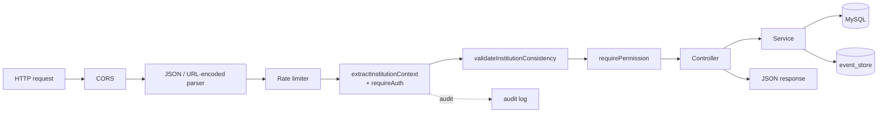

### 2.3 Layered structure (per `Backend/src/ARCHITECTURE.md`)

```
core/        cross-cutting HTTP helpers + moduleRegistry (composition root)
modules/     domain modules — route / controller / service split
shared/      reusable infrastructure (file storage, helpers)
middleware/  app-level: auth, subscriptions, auditing
database/    shared connection, query, transaction helpers
```

Rules (enforced by convention):

1. Route → Controller → Service → DB. **No SQL in routes.**
2. Domain failures throw `ApiError`; central error middleware is the single
   response boundary.
3. File I/O always goes through `shared/storage/fileStorage.js`.

### 2.4 Module registry

Modules are mounted in `Backend/src/core/modules/moduleRegistry.js` —
each is a `{ path, router }` pair under `/api`. See
[Appendix B](#appendix-b--module-registry) for the full list.

### 2.5 Inventory projection pattern

Stock state is kept in a **read model** called `inventory_projections`
(`item_id, warehouse_id` → `on_hand / available / reserved / avg_cost …`).

Most writes flow through an **event log** (`event_store`) and a projection
handler in `Backend/src/projections/inventoryProjections.js`:

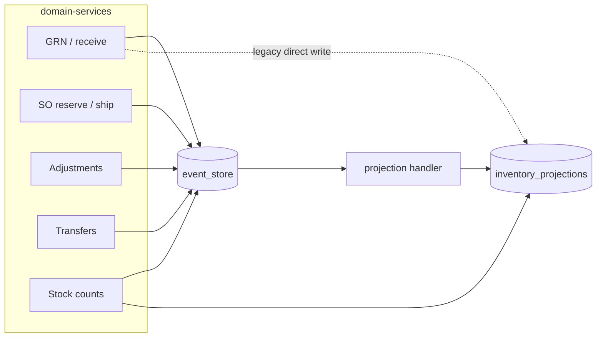

**Caveat** — GRN currently writes to `inventory_projections` *directly*
**and** appends to `event_store`, instead of going through the projection
handler. That path is marked for consolidation (§12.2).

---

## 3. Authentication & multi-tenancy

### 3.1 Tenant model

- `institutions` — one row per customer organization (tenant).
- `institution_users` — users belonging to one institution; `status` = `active`.
- Every domain table carries `institution_id` and every query filters by it.
- Middleware chain enforces this automatically (§2.2):
  - `extractInstitutionContext` → puts `req.institutionId` from JWT.
  - `validateInstitutionConsistency` → blocks if `req.user.institutionId !== req.institutionId`.

### 3.2 Public auth endpoints

`Backend/src/modules/auth/auth.routes.js`

| Method | Path                                | Purpose                         |
| ------ | ----------------------------------- | ------------------------------- |
| POST   | `/api/auth/send-otp`                | start registration via email    |
| POST   | `/api/auth/verify-registration-otp` | verify email OTP                |
| POST   | `/api/auth/register-institution`    | create tenant + owner + trial   |
| POST   | `/api/auth/login`                   | email + password → OTP         |
| POST   | `/api/auth/verify-otp`              | OTP → access + refresh JWT     |
| POST   | `/api/auth/refresh`                 | rotate access token             |
| POST   | `/api/auth/heartbeat`               | keepalive                       |
| POST   | `/api/auth/forgot-password`         | reset OTP send                  |
| POST   | `/api/auth/verify-reset-otp`        | verify reset OTP                |
| POST   | `/api/auth/reset-password`          | apply new password              |

### 3.3 Login + session flow

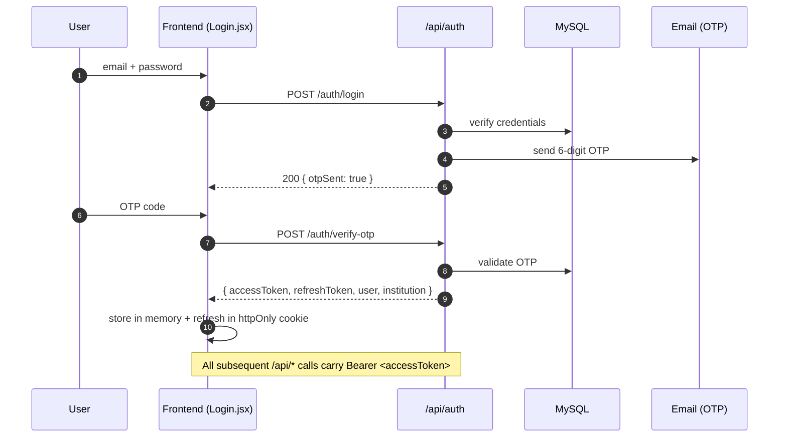

### 3.4 Platform admin (cross-tenant)

A separate control plane for the vendor's operations team. Uses a different
JWT and skips the per-institution middleware:

```
POST /api/platform/auth/login
GET  /api/platform/me
GET  /api/platform/stats
GET  /api/platform/institutions
PATCH /api/platform/institutions/:id
PATCH /api/platform/institutions/:id/status
```

Pages: `Frontend/src/pages/auth/PlatformAdminLogin.jsx` + `Frontend/src/platform/*`.

### 3.5 Permissions

The access system is **permission-based**, not role-based. Roles map to a
`permissions: string[]` claim on the JWT and each route calls
`requirePermission('...')`. See [Appendix A](#appendix-a--permission-catalogue)
for the full list. `user.all === true` is a superuser escape hatch.

---

## 4. Onboarding

Guided first-run experience, gated by step completion, persisted in
`onboarding_progress`.

### 4.1 Steps (defined in `Backend/src/modules/onboarding/onboarding.service.js` → `STEPS`)

| # | Step id            | Target page        |
| - | ------------------ | ------------------ |
| 1 | `company_profile`  | `/company-settings`|
| 2 | `add_warehouse`    | `/warehouses`      |
| 3 | `add_item`         | `/items`           |
| 4 | `add_customer`     | `/sales/customers` |
| 5 | `add_vendor`       | `/purchases/vendors` |
| 6 | `create_invoice`   | `/invoices/sales`  |
| 7 | `invite_user`      | `/users`           |

### 4.2 Auto-detection

`GET /api/onboarding` runs `autoDetect()` which counts real records in
`warehouses`, `items` (non-draft), `customers`, `vendors`,
`institution_users` (non super-admin), `sales_invoices`, and
`company_settings` / `company_addresses` — and auto-marks a step as
`completed` when the check passes. The wizard never *creates* business
entities; the user creates them on the target page, the wizard only
records progress.

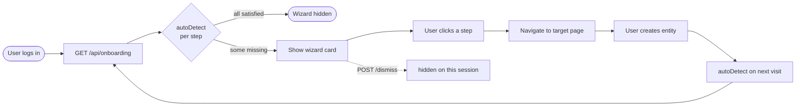

---

## 5. Master data setup

| Entity            | Table(s)                                         | Backend routes                | Frontend page               |
| ----------------- | ------------------------------------------------ | ----------------------------- | --------------------------- |
| Categories        | `categories`                                     | `/api/categories`             | (inline on Items)           |
| Brands            | `brands`                                         | `/api/brands`                 | (inline on Items)           |
| Manufacturers     | `manufacturers`                                  | `/api/manufacturers`          | (inline on Items)           |
| Units of measure  | `units`                                          | `/api/units`                  | Settings → Units            |
| Taxes             | `tax_*`                                          | `/api/tax/*`                  | `TaxManagement.jsx`         |
| Price lists       | price-list tables                                | `/api/price-lists/*`          | `PriceLists.jsx`            |
| Items             | `items`, `item_variant_attributes`               | `/api/items`                  | `Items.jsx`                 |
| Warehouses        | `warehouses`                                     | `/api/warehouses`             | `Warehouses.jsx`            |
| Warehouse types   | `warehouse_types`                                | `/api/warehouse-types`        | Settings → Warehouse types  |
| Zones/Racks/Bins  | `warehouse_zones` / `_racks` / `_bins`           | `/api/warehouse-locations/*`  | `WarehouseLocations.jsx`    |
| Zone/bin type catalogs | `warehouse_zone_types`, `warehouse_bin_types` | `/api/warehouse-locations/zone-types`, `/bin-types` | Warehouse Locations → Types tab |

Items may have **variants** (parent/child via `parent_item_id` + JSON
`variant_attributes`) and a **default bin** (`items.default_bin_id`,
surfaced on the item form).

---

## 6. Warehouse hierarchy (Zones → Racks → Bins)

### 6.1 Physical model

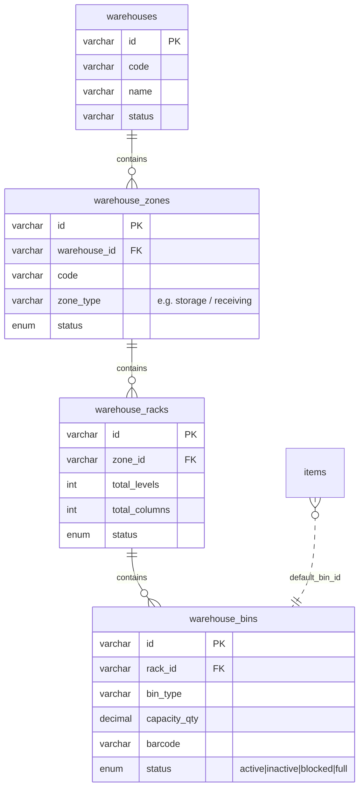

### 6.2 Type catalogs (user-customizable)

- `warehouse_zone_types` — e.g. `storage`, `receiving`, `cold_storage`,
  plus any custom code the tenant defines.
- `warehouse_bin_types` — `standard`, `shelf`, `pallet`, plus custom.

Built-in rows are flagged `is_system = 1`: they can be renamed or
deactivated, but **never deleted** and their `code` is immutable.
Custom rows support full CRUD, with **hard-delete refused** when any
zone/bin still references the code (409 + usage count). Soft-delete
(`status = 'inactive'`) always works.

`GET /api/warehouse-locations/constants` is the UI's consolidated source
for dropdowns — it returns `{ zoneTypes, binTypes, binStatuses }` where
zone/bin types come from the per-institution catalog and statuses remain
a hardcoded workflow-state enum (`active | inactive | blocked | full`).

### 6.3 CSV bin import

Upload a CSV with columns `warehouseCode, zoneCode, rackCode, code, name,
binType, binLevel, binColumn, capacityQty, capacityUnit, barcode, status`.
Missing zones/racks are **auto-created** by code. Duplicate bin codes in
the same rack are skipped. Each bad row is reported back with its row
number and error.

---

## 7. Procurement

### 7.1 Entity map

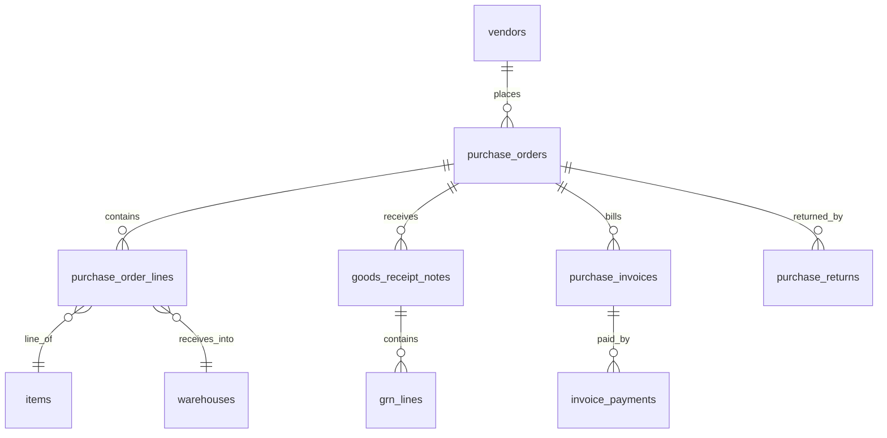

### 7.2 End-to-end narrative

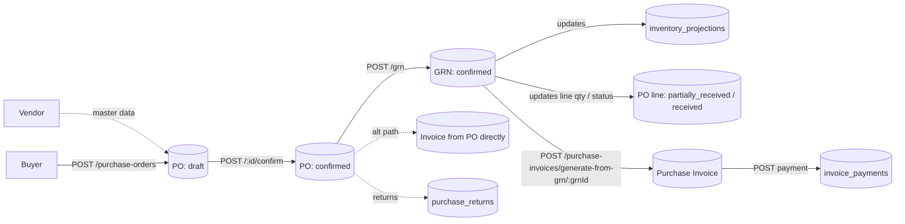

### 7.3 Purchase Order lifecycle

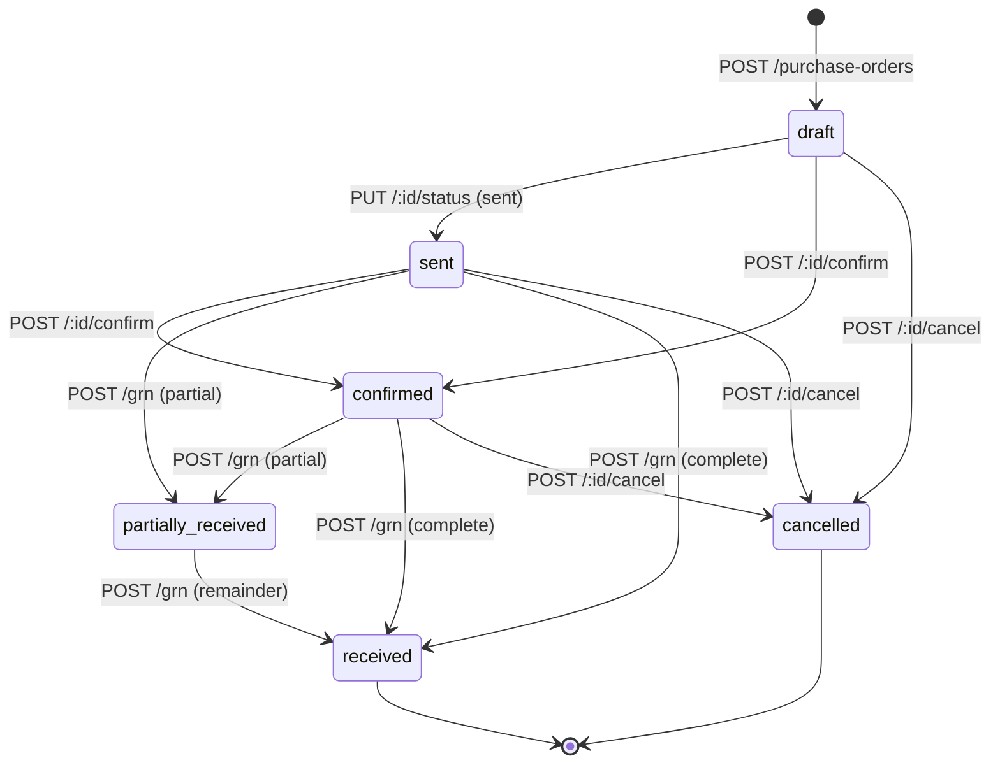

**Note:** the Joi schema also accepts `pending_approval` and `approved`,
but no service in the current code transitions into those states — they
exist on paper only (§12.3).

### 7.4 GRN — what actually happens

`POST /api/grn` in `Backend/src/modules/order/purchaseOrder.service.js`
does all of the following in a single transaction, per line:

1. Validates `warehouseId` matches the PO line's warehouse (mismatch ⇒ 400).
2. Validates `quantity_received ≤ quantity_pending`.
3. Inserts `grn_lines`.
4. Updates `purchase_order_lines.quantity_received` and `status` to
   `pending | partially_received | received` via a SQL `CASE`.
5. Upserts `inventory_projections`:
   - `quantity_on_hand += qty`
   - `quantity_available += qty`
   - `average_cost` recomputed (weighted average)
   - `total_value` recomputed
   - `version += 1`
6. Inserts a row into `event_store` with `event_type = 'PurchaseReceived'`
   and idempotency key `receive-${grnLineId}`.
7. Updates the PO header status (`partially_received` or `received`).

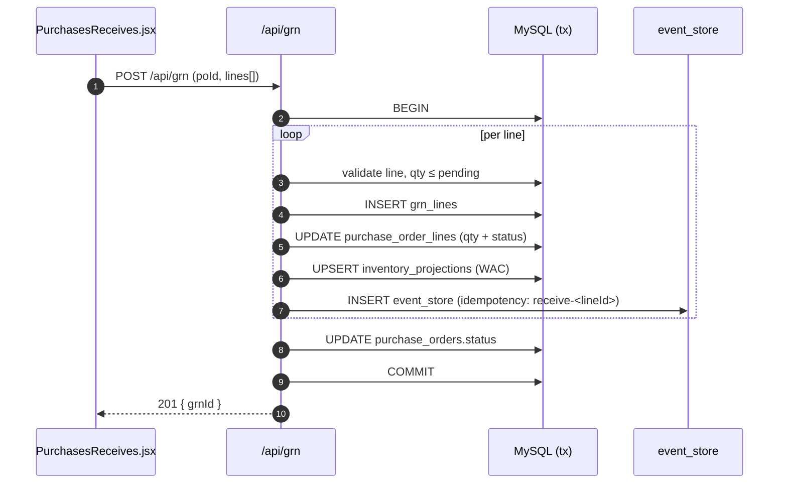

### 7.5 Bin assignment (current state)

`items.default_bin_id` is written & readable on the Items page, but the
GRN service **does not yet read it** — so stock lands at warehouse
granularity only. Introducing bin-level stock (a new `bin_inventory`
table + suggestion logic at GRN time) is a planned next phase (§12.1).

### 7.6 Purchase Invoice → Payment

- `POST /api/purchase-invoices/generate-from-po/:poId` — from a confirmed PO.
- `POST /api/purchase-invoices/generate-from-grn/:grnId` — from an accepted GRN.
- `POST /api/purchase-invoices/:id/post` — posts journal entries to `accounting_entries`.
- `POST /api/purchase-invoices/:id/payments` — records a payment into `invoice_payments` (`invoice_type = 'purchase'`).
- Payments list: `GET /api/accounting/payments` (also powers Purchases → Payments Made).

### 7.7 Purchase Returns

`/api/purchase-returns/*` — plus an “auto-PO from return” shortcut at
`/api/purchase-returns/auto-po/*`. Page: `PurchaseReturns.jsx`.

---

## 8. Sales

### 8.1 Entity map

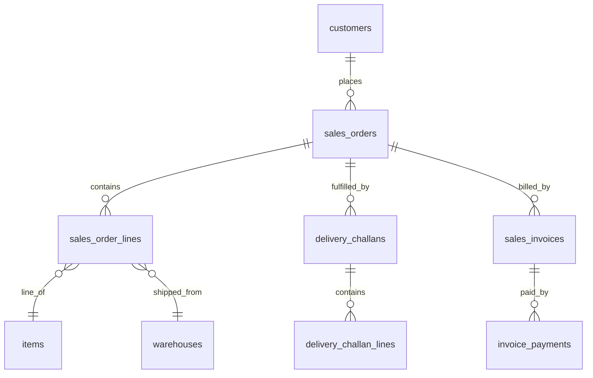

### 8.2 End-to-end narrative

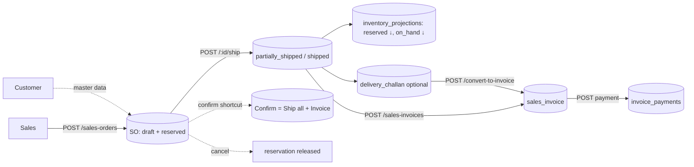

### 8.3 Sales Order lifecycle

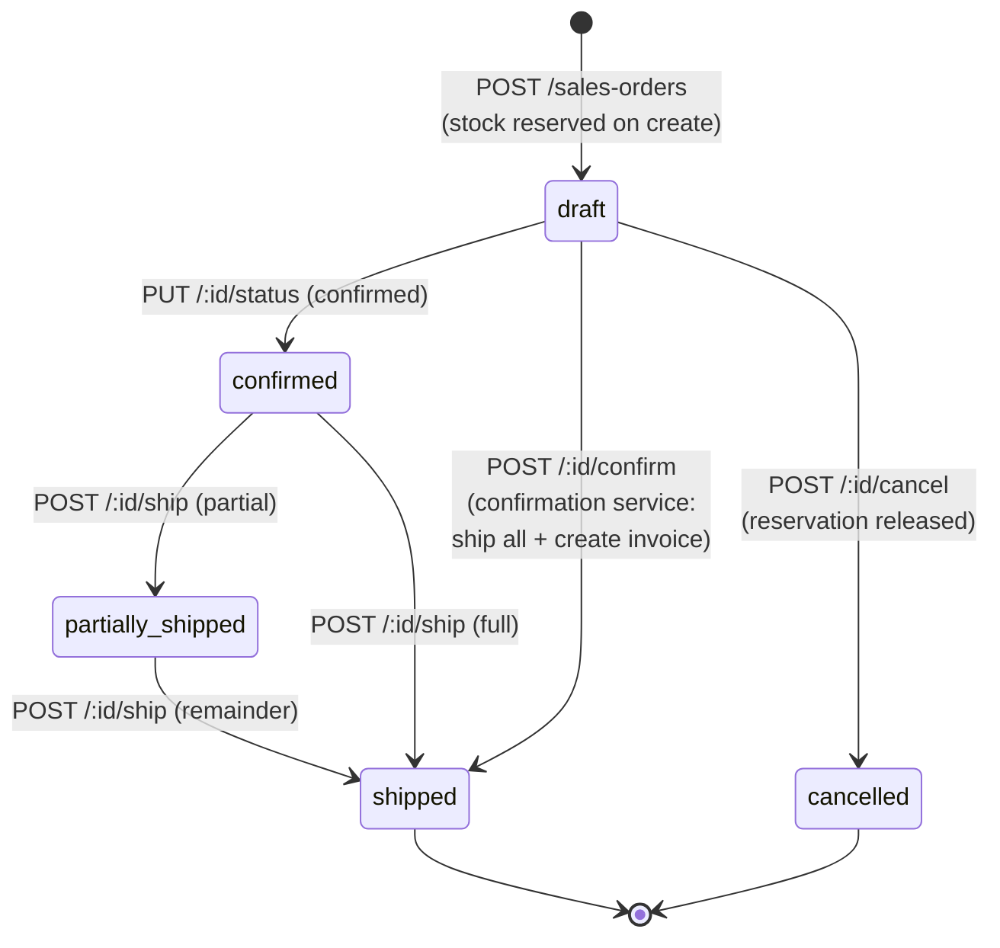

**Reservations:** `POST /sales-orders` always calls
`inventoryService.reserveStock` for every line, emitting a
`SALE_RESERVED` event that moves `quantity_reserved` up and
`quantity_available` down in `inventory_projections`.

**Ship:** emits `SALE_SHIPPED`, which decreases `quantity_on_hand`
(and resolves the reservation).

### 8.4 Delivery Challan → Sales Invoice

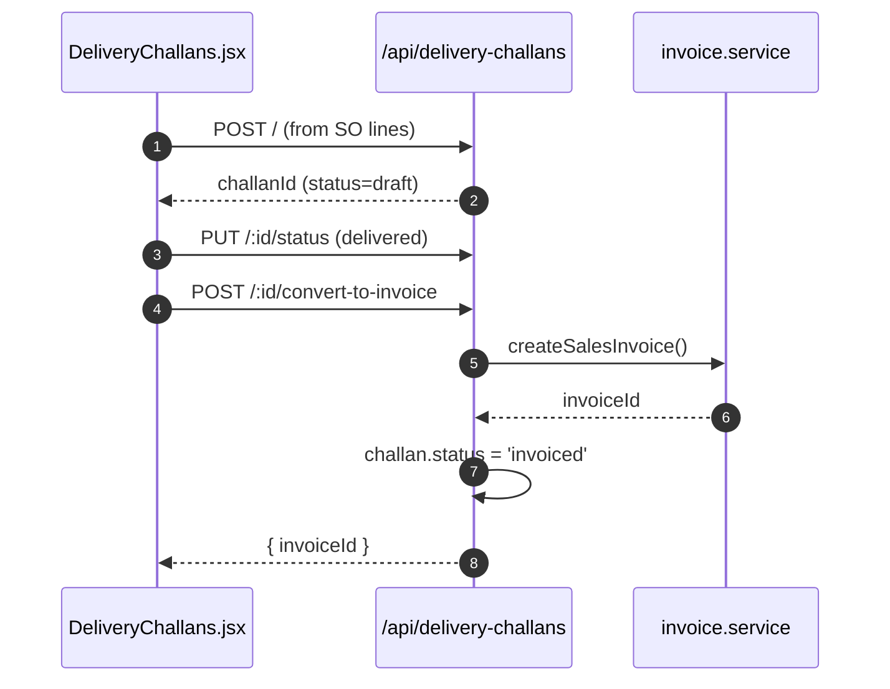

### 8.5 Sales Invoice → Payment Received

- `POST /api/sales-invoices` — create.
- `POST /api/sales-invoices/:id/post` — post journal entries.
- `POST /api/sales-invoices/:id/payments` — records a payment in `invoice_payments` (`invoice_type = 'sales'`).
- Dashboards: `GET /api/invoices/dashboard/summary`, `GET /api/invoices/dashboard/outstanding`.

### 8.6 Other sales pages

- `SalesReturns.jsx`, `CreditNotes.jsx` — UI present; note §12.4.
- `Shipments.jsx`, `Packages.jsx` — note §12.5.

---

## 9. Inventory operations

### 9.1 Stock state model

`inventory_projections` is the single read model for stock:

| Column                 | Meaning                                                |
| ---------------------- | ------------------------------------------------------ |
| `quantity_on_hand`     | physical stock present                                 |
| `quantity_reserved`    | held for open SOs                                      |
| `quantity_available`   | `on_hand − reserved` (saleable)                        |
| `average_cost`         | weighted average unit cost                             |
| `total_value`          | `on_hand × average_cost`                               |
| `last_movement_date`   | last mutation timestamp                                |
| `version`              | optimistic concurrency token                           |

Most mutations are driven by **`event_store`** (GRN is the current
exception — §12.2).

### 9.2 Inventory adjustment

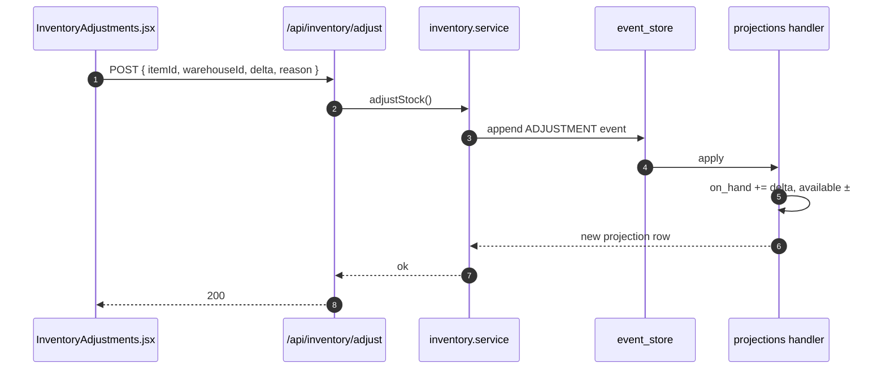

### 9.3 Transfers

Two flavours:

1. **Direct transfer** — `POST /api/inventory/transfer` writes a
   `TRANSFER_OUT` + `TRANSFER_IN` event pair immediately. Used by
   `MoveOrders.jsx` in a simple loop.
2. **Transfer approval workflow** — `transfer_requests` table:
   - `POST /api/transfer-approvals` creates a request (notifies approvers).
   - `POST /api/transfer-approvals/:id/approve` calls
     `inventoryService.transferStock` (same event pair as above).
   - `POST /api/transfer-approvals/:id/reject` / `cancel`.

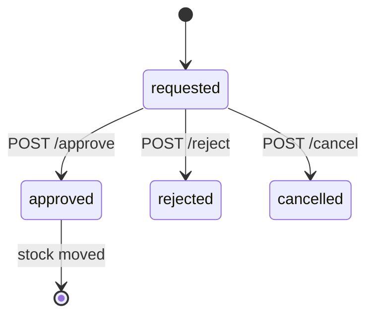

History view: `GET /api/inventory/transfers` reads from `event_store`
(`event_type = 'TransferOut'`).

### 9.4 Stock counts

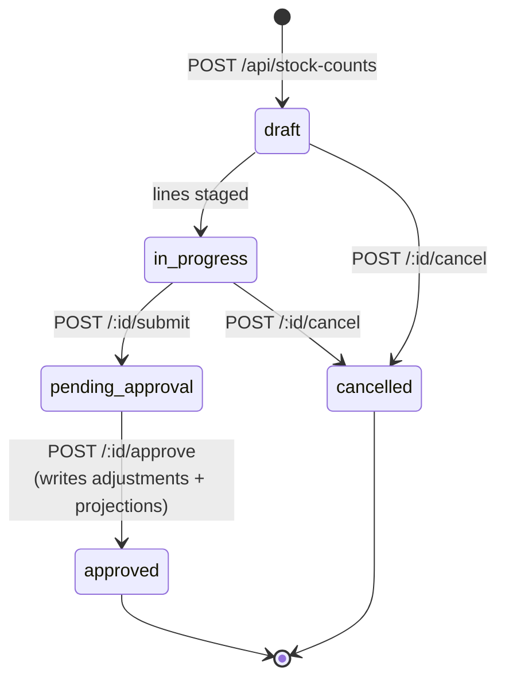

On **approve**, each counted line that differs from system quantity
produces an adjustment row in `inventory_adjustments` and updates
`inventory_projections` (setting `quantity_available = max(on_hand − reserved, 0)`).

### 9.5 Batch / Serial

- API: `/api/batch-serial/*` — CRUD + expiry alerts.
- Page: `BatchTracking.jsx`.

### 9.6 Reorder levels

- API: `/api/reorder-levels/*` — per item+warehouse min/reorder quantities.
- Page: `ReorderLevels.jsx`.
- Consumed by low-stock alerts (`notification.service.js`).

### 9.7 Putaways (partial)

`Putaways.jsx` loads `/api/grn/pending-receipts` and attempts to
`POST /api/inventory/receive`. **The `/api/inventory/receive` route is
currently not registered** — the controller method exists but nothing
serves it. The GRN flow already receives stock, so this screen is
effectively decorative today. See §12.6 for the fix plan.

---

## 10. Accounting & Reporting

### 10.1 Accounting

Read-only aggregates exposed by `/api/accounting/*`:

| Path                            | What it returns                           |
| ------------------------------- | ----------------------------------------- |
| `/summary`                      | headline KPIs                             |
| `/chart-of-accounts`            | account tree (from in-code `CHART_OF_ACCOUNTS`) |
| `/trial-balance`                | per-account debit/credit totals           |
| `/journal-entries`              | `accounting_entries` with filters         |
| `/payables`                     | unpaid purchase invoices                  |
| `/receivables`                  | unpaid sales invoices                     |
| `/payments`                     | `invoice_payments` merged                 |
| `/ledger/:accountCode`          | GL-style view                             |

Posting sales/purchase invoices is what writes rows into
`accounting_entries` (done via helpers inside the respective invoice
services).

### 10.2 Reports

Three coexisting report surfaces:

| Path              | Scope                                        |
| ----------------- | -------------------------------------------- |
| `/api/reports/*`  | operational reports (inventory, sales, purchases, low-stock, valuation, vendor performance, etc.) |
| `/api/profit-loss/*` | dedicated P&L (totals, details, movements)|
| `/api/analytics/*`   | dashboard-shaped aggregates (valuation, trends) |

Frontend: `Reports.jsx`, `ProfitLoss.jsx`, `Dashboard.jsx`,
`AuditDashboard.jsx`.

> The three P&L endpoints differ in shape and consumers — reconciliation
> is tracked in §12.7.

---

## 11. Cross-cutting concerns

### 11.1 Audit logs

- `audit_log` middleware wraps mutating routes and records
  action + actor + entity in `audit_logs`.
- Surface endpoints (`/api/audit/*`): trail, summary, dashboard,
  per-user activity, “my activity”, per-entity.
- There is also a separate in-process `auditLogService` used by
  `purchaseOrder.service.js` on cancel — two partially overlapping
  notions of “audit”; the middleware is authoritative.

### 11.2 Notifications

- Table: `notifications` (`notification.service.js`).
- Triggers (non-exhaustive): transfer approval requested, low stock
  crossed, GRN completed.
- API: `GET /api/notifications`, `GET /unread-count`,
  `PUT /:id/read`, `PUT /mark-all-read`.

### 11.3 Documents

- API: `/api/documents/folders`, `/upload`, list, delete.
- Tables: `document_folders`, `documents`.
- Storage goes through `shared/storage/fileStorage.js`.

### 11.4 Workflow automation

- Tables: `workflow_rules`, `workflow_logs`.
- API: `/api/workflows` (CRUD + `/logs` + `/:id/toggle`).
- Triggered in-process by domain services — e.g. `inventory.service.js`
  calls `workflow.service.trigger('stock_received', …)` from the receive
  path; subscribed rules execute their configured actions (notify,
  webhook, auto-adjust, etc.).

### 11.5 Subscription, billing & feature gates

- `/api/subscription/*` — plan state for the current tenant.
- Middleware `checkFeature('warehouses')`, `checkLimit(...)` are applied
  per module to block access or enforce quotas based on the tenant's
  plan.

### 11.6 Settings

- `/api/settings/*` — per-institution settings (currencies, exchange
  rates via `ExchangeRateSettings.jsx`).
- `/api/company-settings/*` — owner-level branding and registration info
  (page `CompanySettings.jsx`).

---

## 12. Known gaps & caveats

Items below are real issues in the current codebase. They are **not**
blockers for the documented flows, but they are things a new engineer
should know before digging in.

### 12.1 `items.default_bin_id` is write-only

The column is persisted and the UI lets users pick a default bin per
item, but no receiving / putaway flow currently reads it. Next step
outlined in `docs/WORKFLOW.md` §7.5 — add a `bin_inventory` table and
teach GRN to consume the default.

### 12.2 GRN writes projections directly

`purchaseOrder.service.js#createGRN` updates `inventory_projections`
inline **and** appends to `event_store`. Every other mutation flows
through the projection handler. Consolidate by moving GRN onto the
`PurchaseReceived` event handler to avoid divergence.

### 12.3 PO approval states are schema-only

`updatePOStatus` accepts `pending_approval` and `approved` in Joi, but
no code path actually uses them. Either wire an approval flow or remove
from the schema.

### 12.4 Credit notes / sales returns UI is misaligned

- `CreditNotes.jsx` and `VendorCredits.jsx` query list endpoints with
  `?type=credit_note`, which the controllers ignore. The POST bodies
  don't match the `createSalesInvoiceSchema` / `createPurchaseInvoiceSchema`
  validators.
- `SalesReturns.jsx` POSTs `status: 'returned'` to `/api/sales-orders`,
  which creates a `draft` SO anyway and reserves stock — not what the
  user means.

### 12.5 Stub pages

- `Packages.jsx` and `ItemGroups.jsx` are UI shells with no backend
  wiring. They render empty state and placeholder controls only.

### 12.6 Putaway endpoint missing

`POST /api/inventory/receive` is called by `Putaways.jsx` but the route
is not registered. Controller method `receiveStock` exists in
`inventory.controller.js` but has no `router.post` pointing at it. Pick
one:
- Delete the page and controller method (GRN already receives), or
- Register the route and rescope Putaways to a true two-step flow
  (receiving-zone bin → final bin).

### 12.7 Three P&L endpoints

`/api/reports/profit-loss`, `/api/profit-loss`, and
`/api/analytics/profit-loss` coexist. Document which is canonical for
the dashboard and deprecate the others.

### 12.8 Frontend/backend permission name mismatch

`Frontend/src/App.jsx` uses `inventory_shipment` and `inventory_putaway`,
but the backend only recognizes `inventory_ship` and `inventory_receive`.
Non-superusers may get 403 on the corresponding pages.

### 12.9 Workflow routes lack explicit permission checks

`/api/workflows/*` is protected by tenant auth only — no
`requirePermission`. Any authenticated user can create / edit / delete
workflow rules. Add a permission gate.

---

## Appendix A — Permission catalogue

The set of permission strings enforced by `requirePermission(...)` across
route files. The JWT carries `permissions: string[]` and `all: boolean`
(`all === true` bypasses checks).

| Group         | Permission                                                                              |
| ------------- | --------------------------------------------------------------------------------------- |
| Admin         | `user_management`, `api_key_management`, `audit_view`                                   |
| Items         | `item_view`, `item_management`                                                          |
| Categories    | `category_view`, `category_management`                                                  |
| Warehouses    | `warehouse_view`, `warehouse_management`, `warehouse_type_view`, `warehouse_type_management` |
| Vendors       | `vendor_view`, `vendor_management`                                                      |
| Customers     | `customer_view`, `customer_management`                                                  |
| Purchases     | `purchase_view`, `purchase_management`                                                  |
| Sales         | `sales_view`, `sales_management`                                                        |
| Invoices      | `invoice_view`, `invoice_management`                                                    |
| Inventory     | `inventory_view`, `inventory_receive`, `inventory_reserve`, `inventory_ship`, `inventory_adjust`, `inventory_transfer`, `inventory_management` |

See §12.8 for frontend-only strings that don't map to this list.

---

## Appendix B — Module registry

From `Backend/src/core/modules/moduleRegistry.js`. Every entry is mounted
under `/api<path>`:

```
/users                     auth/user.routes
/roles                     auth/role.routes
/items                     entity/item.routes
/manufacturers             entity/manufacturer.routes
/brands                    entity/brand.routes
/units                     master-data/units.routes
/dropdown-options          master-data/dropdownOptions.routes
/categories                entity/category.routes
/warehouses                warehouse/warehouse.routes
/warehouse-types           warehouse/warehouseType.routes
/warehouse-locations       warehouse/warehouseLocation.routes
/inventory                 inventory/inventory.routes
/purchase-orders           order/purchaseOrder.routes
/vendors                   entity/vendor.routes
/customers                 entity/customer.routes
/sales-orders              order/salesOrder.routes
/invoices                  invoice/invoice.routes
/purchase-invoices         invoice/purchaseInvoice.routes
/accounting                invoice/accounting.routes
/sales-invoices            invoice/salesInvoice.routes
/grn                       order/grn.routes
/reorder-levels            inventory/reorderLevel.routes
/batch-serial              inventory/batchSerial.routes
/stock-counts              inventory/stockCount.routes
/purchase-returns          order/purchaseReturn.routes
/data                      master-data/allData.routes
/reports                   reports/reports.routes
/profit-loss               reports/profitLoss.routes
/settings                  settings/settings.routes
/company-settings          settings/companySettings.routes
/documents                 documents/document.routes
/delivery-challans         order/deliveryChallan.routes
/transfer-approvals        inventory/transferApproval.routes
/analytics                 reports/analytics.routes
/notifications             notification/notification.routes
/audit                     audit/audit.routes
/onboarding                onboarding/onboarding.routes
/tax                       tax/tax.routes
/price-lists               price-lists/priceList.routes
/subscription              subscription/subscription.routes
/workflows                 workflows/workflow.routes
```

Platform admin and public auth are served under `/api/platform` and
`/api/auth` respectively, outside the tenant middleware chain.

---

*End of document.*
